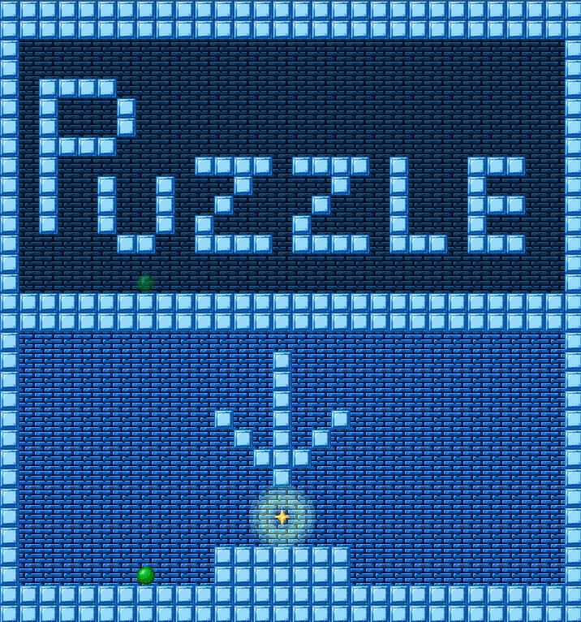
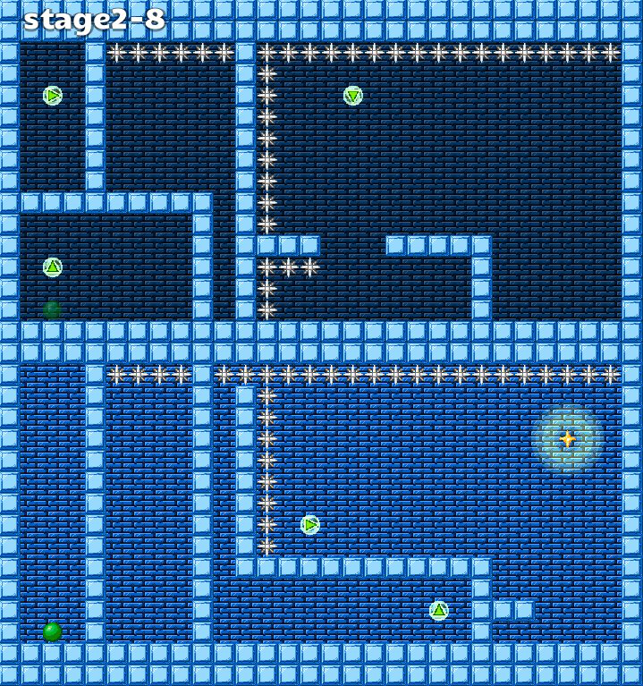

# Puzzle

東京工業大学2016工大祭で、ロボット技術研究会 CG-SQUAREとして展示したゲームです。

**※画像は開発中のものです。**

---

- **タイトル**
    - **Puzzle**
- **製作者**
    - **ゲーム:**
        - **[Ark](http://arkark.github.io/ )**
    - **音楽: (敬称略)**
        - **CLK**
        - **[魔王魂](http://maoudamashii.jokersounds.com/music_rule.html )**
- **ジャンル**
    - **2Dアクションパズルゲーム**
- **開発環境**
    - **Kotlin**
    - **libGDX**
---

### ゲーム概要

プレイヤーのテレポート機能とステージのギミックを駆使して星を手に入れよう！

本ゲームは、架歩氏が作成されたフリーゲーム「テレポー塔 / テレポー塔プラス」のゲームアイデアを元にして作りました。

このテレポー塔というゲームはとてもおもしろく、頭を使う系のパズルゲーが好きな人には是非遊んでいただきたい作品の１つです。

→[私設創作所](http://park17.wakwak.com/~ss1/top.htm )

---

### 操作方法

- ゲームプレイ時
    - →←: 左右に移動
    - Zキー: ジャンプ
    - Xキー: テレポート
    - Qキー: リトライ
    - Escapeキー, BackSpaceキー: タイトルに戻る
- ステージセレクト時
    - ↑↓→←: ステージの選択
    - Enterキー, Spaceキー, Zキーなど: 決定
    - Escapeキー, BackSpaceキー: キャンセル

---

### 免責事項

本ゲームを使用したことによって生じたすべての障害・損害・不具合等に関しては、私と私の関係者および私の所属するいかなる団体・組織とも、一切の責任を負いません。各自の責任においてご使用ください。

---

### ダウンロード
**[こちら](./puzzle.zip)からダウンロードできます。**

Javaがインストールされていればダブルクリックで起動します。

---

#### [戻る](http://arkark.github.io/)
